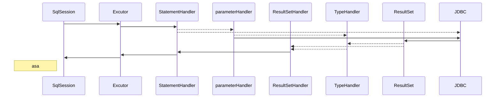
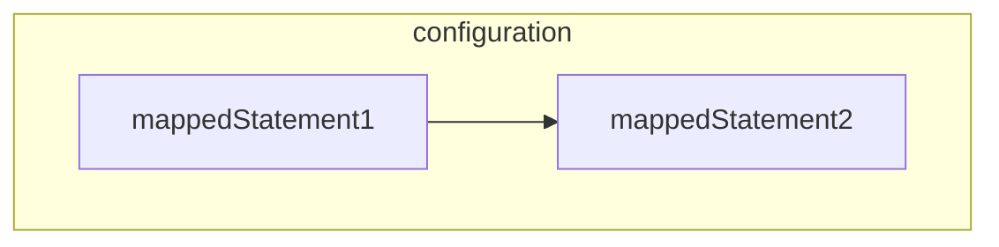

configuration: 

MyBatis框架的配置信息有两种，一种是配置MyBatis框架属性的主配置文件；另一种是配置执行SQL语句的Mapper配置文件。Configuration的作用是描述MyBatis主配置文件的信息


个人理解：

作为注册信息的载体，各种属性开关，Configuration组件还作为Executor、StatementHandler、ResultSetHandler、ParameterHandler组件的工厂类，用于创建这些组件的实例


excutor

Executor接口中定义了对数据库的增删改查方法，其中query()和queryCursor()方法用于执行查询操作，update()方法用于执行插入、删除、修改操作


MappedStatement

MyBatis通过MappedStatement描述<select|update|insert|delete>或者@Select、@Update等注解配置的SQL信息


StatementHandler

StatementHandler组件封装了对JDBC Statement的操作，例如设置Statement对象的fetchSize属性、设置查询超时时间、调用JDBC Statement与数据库交互等。


TypeHandler

处理JDBC类型与Java类型之间的转换


ParameterHandler

如果SQL语句中有参数占位符，在执行SQL语句之前，就需要为参数占位符设置值。ParameterHandler的作用是在PreparedStatementHandler和CallableStatementHandler操作对应的Statement执行数据库交互之前为参数占位符设置值


ResultSetHandler

ResultSetHandler用于在StatementHandler对象执行完查询操作或存储过程后，对结果集或存储过程的执行结果进行处理

```

```

