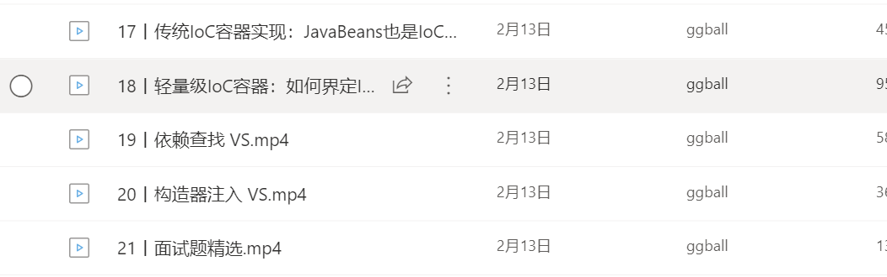
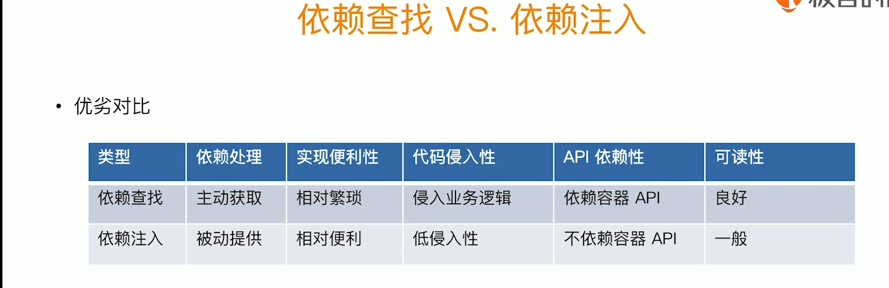

**mood:** :smile:  																		**date: 2021-05-31**  
## 今日计划  
------

- [x]  跟进团购订单nc问题
- [x] 4.6.2分支恢复代码
- [x] 写4.6.2任务量审查
- [x] springIoc(5)
- [x] webflux Demo搭建
## 明日计划  
------
- [ ]  节假日订单发票 查询发票信息 调nc接口过慢（测试环境），正式环境正常
- [ ]  仓发和厂发区别，完成限制操作
- [ ]  完成更新接口
- [ ]  测试nc接口
## 随写 
------

更新发票开票状态

invoiceType 节假日 gift 团购 ent

orderBillICode订单号

orderBillIDetailCode 订单明细号

invoiceCode 发票号

invoiceFlag 

 一个轻量级容器特征

1. 可以更好的管理代码
2. 容器可以快速启动
3. 容器不需要很多配置来部署
4. 可以达到轻量级的内存占用，和最小化的api依赖
5. 容器有一个可以被管控的渠道，主要是方便部署和减少性能开销