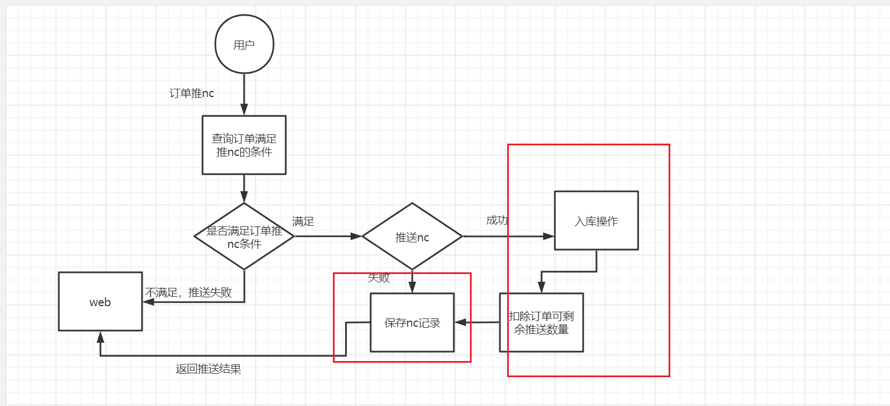

**mood:** :smile:  																		**date: 2021-06-30**  
## 今日计划  
------
- [ ]  
## 明日计划  
------
- [ ]  
## 随写 
------

## 节假日礼品

### nc推送订单（手动）GiftOrderServiceImpl 4771



问题：

1. 推送nc完成之后，需要完成nc出库，扣除nc订单数量，记录两张nc记录表，以上这几个操作如果出现问题，就会造成回滚，且nc已推送，数据不一致问题
2. 推送nc方法 不仅是推送nc,里面还有保存nc记录操作，增加方法复杂性

```java
 public void handleGiftNC(SysUserEntity userEntity, String orderBillId) {
        // 订单已经推送NC成功的，不再推送。如线下支付已推送，又转线上
        OrderNc entOrderNc = orderNcDao.selectOrderNcByParams(orderBillId, EntConsts.NCResultType.SUCCESS);
        if (entOrderNc != null) {
            return;
        }
        NCOrderResponse response = null;
        String sb = "";
        boolean isSuccess = false;
        Date ncPushTime = new Date();
        try {
            if (needNC) {
                List<NCOrderRequest> ncList = new ArrayList<>();
                GiftOrder entOrder = giftOrderDao.selectByPrimaryKey(orderBillId);
                // 查询下单账户地址
                List<GiftOrderCommodity> entOrderCommodityList = giftOrderCommodityDao.selectByOrderIds(Collections.singletonList(orderBillId));
                for (GiftOrderCommodity entOrderCommodity : entOrderCommodityList) {
//                        BigDecimal supplierPriceInit = entOrderCommodity.getSellPriceInit();
//                        BigDecimal supplierPriceNew = entOrderCommodity.getSellPriceNew();
//                        BigDecimal price = supplierPriceInit;
//                        if (supplierPriceNew != null) {
//                            price = supplierPriceNew;
//                        }
                    Integer numberInit = entOrderCommodity.getNumInit();
                    Integer numberNew = entOrderCommodity.getNumNew();
                    Integer num = numberInit;
                    if (numberNew != null) {
                        num = numberNew;
                    }
                    BigDecimal canNcPrice = entOrderCommodity.getCanNcPrice();
                    int canNcNum = entOrderCommodity.getCanNcNum();
                    if (canNcNum <= 0) {
                        log.error("无剩余可推送订单商品数量：{}", entOrderCommodity.getCommodityBillId());
                        continue;
                    }
                    BigDecimal goodPrice = canNcPrice.divide(BigDecimal.valueOf(num), 10, BigDecimal.ROUND_HALF_UP).multiply(BigDecimal.valueOf(canNcNum)).setScale(2, BigDecimal.ROUND_HALF_UP);
                    NCOrderRequest ncOrderRequest = handleGiftNCOrder(userEntity, entOrder, entOrderCommodity, goodPrice, canNcNum);
                    ncList.add(ncOrderRequest);
                }
                if (ncList.isEmpty()) {
                    return;
                }
                // 推送NC订单
                response = thirdNCFeign.pushOrder2NC(ncList, (short) 3);
                // 1表示失败 0表示成功
                if (null == response) {
                    log.error("订单推送到NC系统出错，无法访问");
                } else if ("1".equals(response.getResult())) {
                    log.error("同步过程中出错");
                } else {
                    int result = response.getSuccess().isEmpty() ? 0 : 1;
                    if (1 == result) {
                        log.info("同步成功数据");
                        List<Map<String, Object>> success = response.getSuccess();
                        List<NCBillResp> ncBillRespList = new ArrayList<>();
                        for (Map<String, Object> successMap : success) {
                            String ncBillId = successMap.get("vbillcode").toString();
                            String orderId = successMap.get("orderid").toString();
                            String itemId = successMap.get("itemid").toString();
                            NCBillResp ncBillResp = new NCBillResp();
                            ncBillResp.setItemid(itemId);
                            ncBillResp.setOrderid(orderId);
                            ncBillResp.setVbillcode(ncBillId);
                            ncBillRespList.add(ncBillResp);
                        }
                        response.setSuccessResp(ncBillRespList);
                        Map<String, NCOrderRequest> ncListMap = ncList.stream().collect(Collectors.toMap(NCOrderRequest::getItemid, c -> c));
                        // 推送NC成功后，推送NC出库
                        for (NCBillResp ncBillResp : ncBillRespList) {
                            log.error("开始推送NC出库");
                            String itemid = ncBillResp.getItemid();
                            String vbillcode = ncBillResp.getVbillcode();
                            NCOrderRequest ncOrderRequest = ncListMap.get(itemid);
                            String orderid = ncBillResp.getOrderid();
                            GiftOrder giftOrder = giftOrderDao.selectByPrimaryKey(orderid);
                            Short orgType = giftOrder.getOrgType();
                            if (orgType.equals((short) 2)) {
                                if (ncOrderRequest != null) {
                                    NCOrderPushVo ncOrderPushVo = new NCOrderPushVo();
                                    List<NCOrderPushDetailVo> list = new ArrayList<>();
                                    NCOrderPushDetailVo ncOrderPushDetailVo = new NCOrderPushDetailVo();
                                    String is_direct = ncOrderRequest.getIs_direct();
                                    if (is_direct.equals("Y")) {
                                        ncOrderPushVo.setIsDirect(1);
                                    } else {
                                        ncOrderPushVo.setIsDirect(0);
                                    }
                                    ncOrderPushVo.setNcCode(vbillcode);
                                    if (ncOrderRequest.getBilltype().equals("园区订单")) {
                                        ncOrderPushVo.setOrgType(2);
                                    } else {
                                        ncOrderPushVo.setOrgType(1);
                                    }
                                    ncOrderPushVo.setOrderBillId(ncOrderRequest.getOrderid());
                                    String nnum = ncOrderRequest.getNnum();
                                    String ncCode = ncOrderRequest.getMaterialid();
                                    ncOrderPushDetailVo.setCodeNC(ncCode);
                                    ncOrderPushDetailVo.setNum(Integer.valueOf(nnum));
                                    ncOrderPushVo.setType(2);
                                    list.add(ncOrderPushDetailVo);
                                    ncOrderPushVo.setList(list);
                                    log.error("推送NC出库服务");
                                    giftCheckOrderService.giftPushNCOutStock(ncOrderPushVo);
                                }
                            }
                        }
                        isSuccess = true;
                    } else {
                        if (!response.getFail().isEmpty()) {
                            log.error("同步失败数据 : " + response.getFail().get(0).get("reason"));
                        } else {
                            log.error("同步失败数据 : " + response.getReason());
                        }
                    }
                }
                log.error("当前推送订单ID!" + orderBillId);
                //处理NC结果
                sb = JSON.toJSONString(ncList);
                handleGiftNcResult(orderBillId, sb, response, null, null);
                if (isSuccess) {
                    // 扣除推送NC订单商品数量
                    for (NCOrderRequest ncOrderRequest : ncList) {
                        Long commodityBillId = ncOrderRequest.getCommodityBillId();
                        GiftOrderCommodity giftOrderCommodity = new GiftOrderCommodity();
                        giftOrderCommodity.setCommodityBillId(commodityBillId);
                        giftOrderCommodity.setCanNcNum(0);
                        giftOrderCommodityDao.updateByPrimaryKeySelective(giftOrderCommodity);
                    }
                }
            } else {
                log.debug("关闭nc");
            }
        } catch (Exception e) {
            log.error("当前推送NC失败!" + orderBillId);
            log.error("当前订单推送NC 失败!", e);
            throw new RRException("当前推送NC失败:" + e.getMessage());
        } finally {
            //保存推送NC记录
            keepRecordsNc(response, userEntity, orderBillId, ncPushTime);
        }
    }
```


### nc推送订单（定时任务） EntNcServiceImpl 933

问题:

1. 推送nc完成之后，记录两张nc记录表，以上这几个操作如果出现问题，就会造成回滚，且nc已推送，数据不一致问题
2. 推送nc方法 不仅是推送nc,里面还有保存nc记录操作，增加方法复杂性

```java
  /**
     * @Description: 未录入发票，过60天未推送NC成功的企业单自动推送NC，多个服务执行加分布式锁只执行一个，其他的快速放弃策略
     * 节假日订单云桂单发货时间60天后自动推送NC订单，云致90天后推送NC订单
     * @Author: xzy
     * @Date: 2020/09/15
     */
    @Klock(keys = "", waitTime = 0, lockTimeoutStrategy = LockTimeoutStrategy.FAIL_FAST)
    @Override
    public void invoiceAutoPushNC() {
        // 查找超过60天，未录入发票，推送NC失败或未推送NC的企业单。
        log.error("autoPushNC start");
        List<String> orderBillIdList = orderNcDao.selectOutTimeAutoPushNcOrder();
        if (!orderBillIdList.isEmpty()) {
            for (String orderBillId : orderBillIdList) {
                // 推送NC订单
                handleEntNCAsyn(null, orderBillId, false, false);
            }
        }

        log.error("autoPushNC gift start");
        List<String> giftOrderListYG = orderNcDao.selectOutTimeGiftAutoPushNcOrder();
        if (!giftOrderListYG.isEmpty()) {
            for (String orderBillId : giftOrderListYG) {
                // 推送NC订单
                MQMessage mqMessage = new MQMessage();
                mqMessage.setTag("handleGiftNC");
                mqMessage.setObject(orderBillId);
                mqSender.sendMsg(QueueEnum.WMS_QUEUE.getExchange(), QueueEnum.WMS_QUEUE.getRouteKey(), mqMessage);
            }
        }
        List<String> giftOrderListYZ = orderNcDao.selectOutTimeGiftAutoPushNcOrderYZ();
        if (!giftOrderListYZ.isEmpty()) {
            for (String orderBillId : giftOrderListYZ) {
                // 推送NC订单
                MQMessage mqMessage = new MQMessage();
                mqMessage.setTag("handleGiftNC");
                mqMessage.setObject(orderBillId);
                mqSender.sendMsg(QueueEnum.WMS_QUEUE.getExchange(), QueueEnum.WMS_QUEUE.getRouteKey(), mqMessage);
            }
        }

/*        // 自动推送NC发票
        // 查找超过30天，申请开票推送失败的订单
        List<Long> invoiceIds = orderNcDao.selectOutTimeAutoPushNcOrderInvoice();
        if (!invoiceIds.isEmpty()){
            for(Long id:invoiceIds){
                // 推送NC订单
                handleEntInvoiceNC(null, id);
            }
        }*/
    }

   /**
     * NC 订单处理
     */
    @Override
    public void handleEntNC(EntUserEntity userEntity, String orderIdList) {
        String[] orderIdArray = orderIdList.split(",");
        // 订单已经推送NC成功的，不再推送。如线下支付已推送，又转线上
        for (String orderBillId : orderIdArray) {
            EntOrderNc entOrderNc = orderNcDao.selectOrderNcByParams(orderBillId, EntConsts.NCResultType.SUCCESS);
            if (entOrderNc != null) {
                return;
            }
        }
        StringBuilder sb = new StringBuilder();
        NCOrderResponse response = null;
        Date ncPushTime = new Date();
        try {
            if (needNC) {
                List<NCOrderRequest> ncList = new ArrayList<>();
                for (int i = 0; i < orderIdArray.length; i++) {
                    EntOrder entOrder = entOrderDao.selectByPrimaryKey(orderIdArray[i]);
                    Short saleState = entOrder.getSaleState();
                    // 查询下单账户地址
                    List<EntOrderCommodity> entOrderCommodityList = entOrderCommodityDao.selectByOrderIds(Collections.singletonList(orderIdArray[i]));
                    for (EntOrderCommodity entOrderCommodity : entOrderCommodityList) {
                        Short typeSettle = entOrderCommodity.getTypeSettle();
                        if (typeSettle != null && typeSettle == (short) 2) {
                            // 结算商品不推送NC
                            continue;
                        }
                        BigDecimal supplierPriceInit = entOrderCommodity.getSupplierPriceInit();
                        BigDecimal supplierPriceNew = entOrderCommodity.getSupplierPriceNew();
                        BigDecimal price = supplierPriceInit;
                        if (supplierPriceNew != null) {
                            price = supplierPriceNew;
                        }
                        Integer numberInit = entOrderCommodity.getNumberInit();
                        Integer numberNew = entOrderCommodity.getNumberNew();
                        Integer numberSale = entOrderCommodity.getNumberSale();
                        Integer num = numberInit;
                        if (numberNew != null) {
                            num = numberNew;
                        }
                        BigDecimal goodPrice = price.multiply(BigDecimal.valueOf(num));
                        if (saleState != null && (EntConsts.EntOrderSaleState.SAILING.equals(saleState) || EntConsts.EntOrderSaleState.SUCCESS.equals(saleState))) {
                            // 售后中和售后成功的 减去售后的商品数量
                            if (numberSale != null) {
                                goodPrice = price.multiply(BigDecimal.valueOf((long) num - numberSale));
                            }
                        }
                        if (goodPrice.compareTo(BigDecimal.ZERO) > 0) {
                            NCOrderRequest ncOrderRequest = handleNcOrder(userEntity, entOrder, entOrderCommodity, goodPrice);
                            sb.append(JSON.toJSONString(ncOrderRequest)).append("|");
                            ncList.add(ncOrderRequest);
                        }
                    }
                }
                if (ncList.isEmpty()) {
                    return;
                }
                // 推送NC订单
                response = thirdNCFeign.pushOrder2NC(ncList, (short) 2);
                // 1表示失败 0表示成功
                if (null == response) {
                    log.error("订单推送到NC系统出错，无法访问");
                } else if ("1".equals(response.getResult())) {
                    log.error("同步过程中出错");
                } else {
                    int result = response.getSuccess().isEmpty() ? 0 : 1;
                    if (1 == result) {
                        log.info("同步成功数据");
                    } else {
                        if (!response.getFail().isEmpty()) {
                            log.error("同步失败数据 : " + response.getFail().get(0).get("reason"));
                        } else {
                            log.error("同步失败数据 : " + response.getReason());
                        }
                    }
                }
                log.error("当前推送订单ID!" + orderIdList);
                //处理NC结果
                handleNcResult(orderIdList, sb, response, null);
            } else {
                log.debug("关闭nc");
            }
        } catch (Exception e) {
            log.error("当前推送NC失败!" + orderIdList);
            log.error("当前订单推送NC 失败!", e);
            //处理NC 结果
            try {
                // 报错失败数据
                handleNcResult(orderIdList, sb, response, e.getMessage());
            } catch (Exception e1) {
                log.error("插入NC记录信息失败!", e1);
            }
        }finally {
            // 这里user 直接传null 默认为系统自动推nc
            keepRecordsNc(response,null,orderIdList,ncPushTime);
        }
    }
```


### nc推送发票（手动）GiftOrderServiceImpl 4569

可能会出现的问题：

1. 开发票绑定的订单会相对多一点，推送的时间会更长，可能造成超时问题
2. 推送nc完成之后，需要完成nc出库，扣除nc订单数量，记录两张nc记录表，以上这几个操作如果出现问题，就会造成回滚，且nc已推送，数据不一致问题
3. 推送nc方法 不仅是推送nc,里面还有保存nc记录操作，增加方法复杂性

代码：

```java
        public Boolean handleGiftInvoiceNCWithMessge(SysUserEntity userEntity, Long invoiceId) {
			OrderNc entOrderNc = orderNcDao.selectOrderNcByParams(String.valueOf(invoiceId), EntConsts.NCResultType.SUCCESS);
        if (entOrderNc != null) {
            log.error("已推送发票：{}", invoiceId);
            throw new RRException("订单已推送");
        }
        String sb = "";
        NCOrderResponse response = null;
        boolean isSuccess = false;
        List<InvoiceDetail> invoiceDetails = null;
        Date ncPushTime = new Date();
        try {
            if (needNC) {
                log.error("pushNCInvoice start");
                List<NCOrderRequest> ncList = new ArrayList<>();
                invoiceDetails = invoiceDetailDao.selectByInvoice(invoiceId);
                InvoiceInfo invoiceInfo = invoiceInfoDao.selectByPrimaryKey(invoiceId);
                Assert.isNull(invoiceInfo,"发票信息不存在，invoiceId："+invoiceId);
                Short state = invoiceInfo.getState();
                if (state.equals((short) 40)) {
                    // 作废，不能推送
                    log.error("发票作废，不能推送NC：{}", invoiceId);
                    throw new RRException("发票已作废，不能推送NC");
                }
                if (invoiceDetails != null) {
                    if (!invoiceDetails.isEmpty()) {
                        Boolean hasPushNumber = false;
                        StringBuilder errorMessage = new StringBuilder();
                        for (InvoiceDetail invoiceDetail : invoiceDetails) {
                            String orderBillId = invoiceDetail.getOrderBillId();
                            String ncItemId = invoiceDetail.getNcItemId();
                            Integer makeNum = invoiceDetail.getMakeNum();
                            String orderDetailBillId = invoiceDetail.getOrderDetailBillId();
                            GiftOrder giftOrder = giftOrderDao.selectByPrimaryKey(orderBillId);
                            Assert.isNull(invoiceInfo,"节假日订单不存在，orderBillId："+orderBillId);
                            Short orderState = giftOrder.getOrderState();
                            if (orderState.equals((short) 5)) {
                                // 已取消的部分不推送NC
                                log.error("发票已取消的订单不推送NC, 发票ID:{},订单号:{}", invoiceId, orderBillId);
                                continue;
                            }
                            // 查询下单账户地址
                            GiftOrderCommodity entOrderCommodity = giftOrderCommodityDao.selectByPrimaryKey(Long.valueOf(orderDetailBillId));
//                            BigDecimal supplierPriceInit = entOrderCommodity.getSellPriceInit();
//                            BigDecimal supplierPriceNew = entOrderCommodity.getSellPriceNew();
//                            BigDecimal price = supplierPriceInit;
//                            if (supplierPriceNew != null) {
//                                price = supplierPriceNew;
//                            }
                            Integer numberInit = entOrderCommodity.getNumInit();
                            Integer numberNew = entOrderCommodity.getNumNew();
                            Integer num = numberInit;
                            if (numberNew != null) {
                                num = numberNew;
                            }
                            BigDecimal canNcPrice = entOrderCommodity.getCanNcPrice();
                            int canNcNum = entOrderCommodity.getCanNcNum();
                            if (canNcNum <= 0) {
                                log.error("无剩余可推送订单商品数量,订单商品号：{}", entOrderCommodity.getCommodityBillId());
                                errorMessage.append("无剩余可推送订单商品数量:订单商品号:").append(entOrderCommodity.getCommodityBillId());
                            } else {
                                hasPushNumber = true;
                                BigDecimal goodPrice = canNcPrice.divide(BigDecimal.valueOf(num), 10, BigDecimal.ROUND_HALF_UP).multiply(BigDecimal.valueOf(makeNum)).setScale(2, BigDecimal.ROUND_HALF_UP);
                                NCOrderRequest ncOrderRequest = handleGiftNcInvoice(userEntity, giftOrder, entOrderCommodity, goodPrice, invoiceInfo, ncItemId, makeNum);
                                ncList.add(ncOrderRequest);
                            }
                        }
                        if (!hasPushNumber) {
                            throw new RRException(errorMessage.toString());
                        }
                    }
                }
                if (ncList.isEmpty()) {
                    throw new RRException("无可推送NC信息");
                }
                // 推送NC订单
                log.error("pushGiftNCInvoice begin");
                response = thirdNCFeign.pushOrder2NC(ncList, (short) 3);
                log.error("nc返回结果:{}",response);
                // 1表示失败 0表示成功
                if (null == response) {
                    log.error("开票推送到NC系统出错，无法访问");
                    throw new RRException("开票推送到NC系统出错，无法访问");
                } else if ("1".equals(response.getResult())) {
                    log.error("开票同步过程中出错");
                    throw new RRException("推送NC报错:" + JSON.toJSONString(response));
                } else {
                    int result = response.getSuccess().isEmpty() ? 0 : 1;
                    if (1 == result) {
                        log.info("开票同步成功数据");
                        List<Map<String, Object>> success = response.getSuccess();
                        List<NCBillResp> ncBillRespList = new ArrayList<>();
                        for (Map<String, Object> successMap : success) {
                            String ncBillId = successMap.get("vbillcode").toString();
                            String orderId = successMap.get("orderid").toString();
                            String itemId = successMap.get("itemid").toString();
                            NCBillResp ncBillResp = new NCBillResp();
                            ncBillResp.setItemid(itemId);
                            ncBillResp.setOrderid(orderId);
                            ncBillResp.setVbillcode(ncBillId);
                            ncBillRespList.add(ncBillResp);
                        }
                        response.setSuccessResp(ncBillRespList);
                        isSuccess = true;
                        Map<String, NCOrderRequest> ncListMap = ncList.stream().collect(Collectors.toMap(NCOrderRequest::getItemid, c -> c));
                        // 推送NC成功后，推送NC出库
                        for (NCBillResp ncBillResp : ncBillRespList) {
                            log.error("开始推送NC出库");
                            String itemid = ncBillResp.getItemid();
                            String vbillcode = ncBillResp.getVbillcode();
                            NCOrderRequest ncOrderRequest = ncListMap.get(itemid);
                            String orderid = ncBillResp.getOrderid();
                            GiftOrder giftOrder = giftOrderDao.selectByPrimaryKey(orderid);
                            Short orgType = giftOrder.getOrgType();
                            if (orgType.equals((short) 2)) {
                                if (ncOrderRequest != null) {
                                    NCOrderPushVo ncOrderPushVo = new NCOrderPushVo();
                                    List<NCOrderPushDetailVo> list = new ArrayList<>();
                                    NCOrderPushDetailVo ncOrderPushDetailVo = new NCOrderPushDetailVo();
                                    String is_direct = ncOrderRequest.getIs_direct();
                                    if (is_direct.equals("Y")) {
                                        ncOrderPushVo.setIsDirect(1);
                                    } else {
                                        ncOrderPushVo.setIsDirect(0);
                                    }
                                    ncOrderPushVo.setNcCode(vbillcode);
                                    if (ncOrderRequest.getBilltype().equals("园区订单")) {
                                        ncOrderPushVo.setOrgType(2);
                                    } else {
                                        ncOrderPushVo.setOrgType(1);
                                    }
                                    ncOrderPushVo.setOrderBillId(ncOrderRequest.getOrderid());
                                    String nnum = ncOrderRequest.getNnum();
                                    String ncCode = ncOrderRequest.getMaterialid();
                                    ncOrderPushDetailVo.setCodeNC(ncCode);
                                    ncOrderPushDetailVo.setNum(Integer.valueOf(nnum));
                                    ncOrderPushVo.setType(1);
                                    list.add(ncOrderPushDetailVo);
                                    ncOrderPushVo.setList(list);
                                    log.error("推送NC出库服务");
                                    giftCheckOrderService.giftPushNCOutStock(ncOrderPushVo);
                                }
                            }

                        }
                    } else {
                        if (!response.getFail().isEmpty()) {
                            log.error("开票同步失败数据 : " + response.getFail().get(0).get("reason"));
                            throw new RRException("推送NC报错:" + JSON.toJSONString(response));
                        } else {
                            log.error("开票同步失败数据 : " + response.getReason());
                            throw new RRException("推送NC报错:" + JSON.toJSONString(response));
                        }
                    }
                }
                log.error("当前推送NC开票ID!" + invoiceId);
                //处理NC结果
                sb = JSON.toJSONString(ncList);
                handleGiftNcResult(String.valueOf(invoiceId), sb, response, null, ncList);
                if (isSuccess) {
                    // 扣除推送NC订单商品数量
                    for (NCOrderRequest ncOrderRequest : ncList) {
                        Long commodityBillId = ncOrderRequest.getCommodityBillId();
                        GiftOrderCommodity giftOrderCommodityInDb = giftOrderCommodityDao.selectByPrimaryKey(commodityBillId);
                        Integer canNcNum = giftOrderCommodityInDb.getCanNcNum();
                        Integer nnum = Integer.valueOf(ncOrderRequest.getNnum());
                        GiftOrderCommodity giftOrderCommodity = new GiftOrderCommodity();
                        giftOrderCommodity.setCommodityBillId(commodityBillId);
                        giftOrderCommodity.setCanNcNum(canNcNum - nnum);
                        giftOrderCommodityDao.updateByPrimaryKeySelective(giftOrderCommodity);
                    }
                }
            }
        }
        catch (RRException e) {
            log.error("NC开票失败!" + invoiceId);
            throw new RRException("当前推送NC开票失败:" + e.getMessage());
        } catch (Exception e) {
            log.error("当前推送NC开票失败!" + invoiceId);
            log.error("当前节假日订单推送NC开票 失败!", e);
            throw new RRException("当前推送NC开票失败:" + e.getMessage());
        } finally {
            try {
                // 订单编号集合
                String orderIds = "";
                if (null != invoiceDetails && invoiceDetails.size() > 0) {
                    orderIds = invoiceDetails.stream()
                            .filter(detail -> null != detail)
                            .map(detail -> detail.getOrderBillId())
                            .collect(Collectors.joining(","));
                }
                // 保存nc推送信息
                keepRecordsNc(response, userEntity, invoiceId,orderIds, ncPushTime);
            } catch (Exception e) {
                log.error("nc历史记录保存出错。。");
                e.printStackTrace();
            }
        }
        return isSuccess;
        }
```


### nc推送售后（手动）GiftSaleServiceImpl 2182

逻辑：先推正向单，如果正向单推送成功或者已推送完成，则推逆向单

推正向单的时候，会先检查订单已申请的发票有没有未推送的，有的话先推发票，再推订单，没有则直接推订单

问题：

1. 如果推正向单或者逆向单，有一个抛异常则会造成数据回滚，导致数据不一致
2. 推送逆向单 之后，需要修改售后单nc状态，记录nc记录，以上动作如果抛异常则会造成数据回滚，导致数据不一致

### nc推送售后（正向单推送成功，且售后全部成功）GiftSaleServiceImpl 2013

逻辑：先检查正向单有没有全部推送，没有则推送,推送成功返回true，推送了则返回true

​			正向推送成功才推送逆向，接下来有修改 售后单推送nc状态和 保存推送nc售后记录 动作

问题：

1. 正向推送抛出异常，逆向不会推送，导致数据不一致
2. 逆向推送失败，售后单推送nc状态会回滚，nc记录不会保存


## 团购（不用做）

-  nc推送订单（手动）
-  nc推送订单（定时任务）
-  nc推送发票（手动）

## 叫货

###  nc推送账单（手动）MerchantInvoiceServiceImpl 316

问题：

1. 推送完nc,需要更新账单nc推送状态，保存两张nc记录表，以上有一个抛异常则会造成数据回滚，导致数据不一致

### nc推送账单（定时任务）MerchantInvoiceTask 29

逻辑：未录入发票，过30天未推送NC成功的账单自动推送NC，每天执行

​			保存账单发票 ，推送nc，修改nc推送，状态保存nc记录

问题：

1. 推送完nc,需要更新账单nc推送状态，保存一张nc记录表，以上有一个抛异常则会造成数据回滚，导致数据不一致


## 礼券

### 手动推

​	问题：

1. 手动推完nc之后，会对订单物流表的推送nc状态修改，如果修改出现问题，会出现回滚操作，导致数据不一致

### 导入物流成功后推nc

推完nc无动作

### 巨沃回传物流成功后推nc

推完nc无动作


解决方案：

1. 限制开票的订单数量，避免保存nc记录时，存过多字符

   


